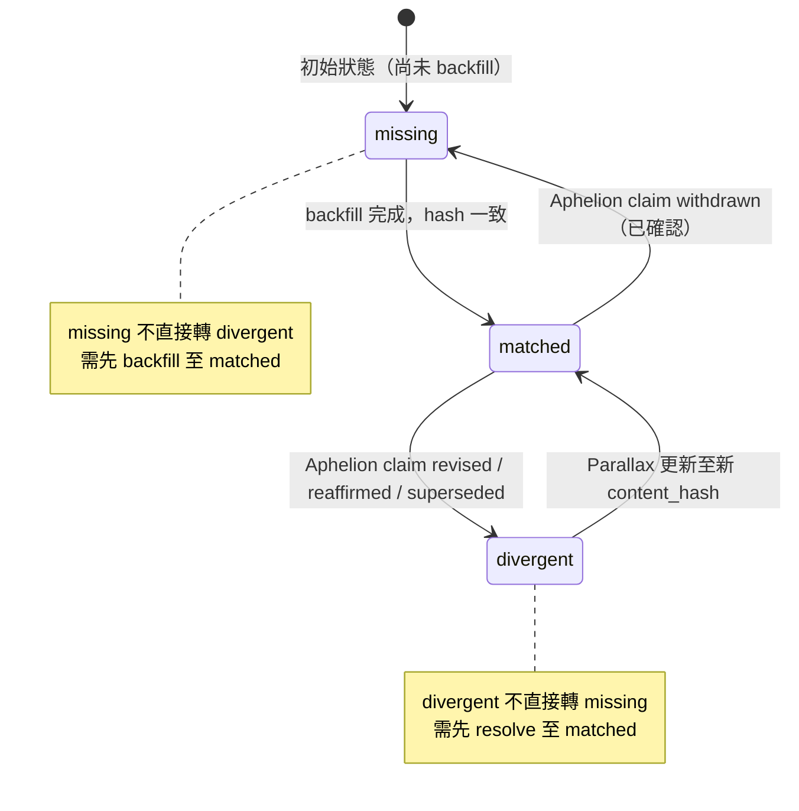

# Crosswalk Schema — 三態語意規範 (Tristate Semantics)

> **Spec version:** m9-prep  
> **Status:** Draft for external review  
> **License:** Apache 2.0 (follows Aphelion project license)  
> **Language note:** 本文以繁體中文撰寫主體說明；所有 schema、code block、型別定義以 English 呈現。

---

## 1. 文件目的與受眾 (Purpose & Audience)

本文件定義 **Aphelion ↔ 外部文件系統 crosswalk table** 中每一列 (row) 的三種可能狀態，以及這些狀態之間的合法轉換。

**受眾：**

- 正在實作 Aphelion-compatible memory layer 的第三方開發者
- 需要將既有文件識別碼 (legacy document ID) 對應至 Aphelion document ID 的 consumer 端維護者
- Parallax 及類似 crosswalk-maintaining toolchain 的 contributor

**不在本文件範圍：**

- 衝突仲裁邏輯 (conflict resolution logic) — 依 Aphelion-ADR-0001，此為 consumer 端責任
- Aphelion claim 內容本身的語意或 lifecycle policy
- Parallax 內部實作細節（僅說明其作為 consumer 的職責邊界）

---

## 2. 三態完整語意 (Tristate Definitions)

Crosswalk table 中每一列的 `status` 欄位必定為以下三態之一，**不會為 null 或其他值**。

### 2.1 `matched` / 對應

**English definition:**  
The external document ID (`dpkg_doc_id`) has a confirmed mapping to an Aphelion document ID (`aphelion_doc_id`), and the **content hash on both sides is identical**. This represents a stable, verified correspondence.

**條件 (Conditions):**

1. `aphelion_doc_id` is non-null
2. `content_hash_dpkg` is non-null
3. `content_hash_aphelion` is non-null
4. `content_hash_dpkg == content_hash_aphelion`

**範例 (Example):**

```
dpkg_doc_id:        "dpkg-2024-00391"
aphelion_doc_id:    "aph-7f3a2c"
status:             "matched"
content_hash_dpkg:      "sha256:a1b2c3..."
content_hash_aphelion:  "sha256:a1b2c3..."
```

兩側 hash 完全一致，代表文件內容已被確認同步。

---

### 2.2 `divergent` / 分歧

**English definition:**  
The external document ID maps to an Aphelion document ID, but the **content hashes do not match**. This typically indicates the Aphelion-side claim has been reaffirmed, revised, or superseded since the crosswalk row was last synchronised.

**條件 (Conditions):**

1. `aphelion_doc_id` is non-null
2. At least one of `content_hash_dpkg`, `content_hash_aphelion` is non-null
3. `content_hash_dpkg != content_hash_aphelion`

**範例 (Example):**

```
dpkg_doc_id:        "dpkg-2024-00391"
aphelion_doc_id:    "aph-7f3a2c"
status:             "divergent"
content_hash_dpkg:      "sha256:a1b2c3..."
content_hash_aphelion:  "sha256:d4e5f6..."
```

Aphelion 端的 claim 經過修訂 (revised)，content hash 已變更，但 Parallax 端尚未更新。

---

### 2.3 `missing` / 缺失

**English definition:**  
The external document ID has **no corresponding entry** in the Aphelion registry. This may be because the document has not yet been backfilled, or because the Aphelion-side claim has been withdrawn.

**條件 (Conditions):**

1. `aphelion_doc_id` is null
2. `content_hash_aphelion` is null
3. `content_hash_dpkg` is non-null（外部文件本身存在）

**範例 (Example):**

```
dpkg_doc_id:        "dpkg-2024-00512"
aphelion_doc_id:    null
status:             "missing"
content_hash_dpkg:      "sha256:789abc..."
content_hash_aphelion:  null
```

此文件尚未被 Aphelion registry 收錄，或已被 withdraw。

---

## 3. 狀態轉換圖 (State Transitions)

合法的狀態轉換如下圖所示。**非箭頭標示的轉換為不合法 (invalid)。**

```
                  backfill 完成
    ┌──────────────────────────────────────┐
    │                                      ▼
 ┌─────────┐   Aphelion claim revised  ┌──────────┐
 │ missing │ ──────────────────────── ✕ │ matched  │
 └─────────┘                            └──────────┘
    ▲    │                               ▲        │
    │    │ Aphelion claim withdrawn      │        │ Aphelion claim revised
    │    │ (confirmed)                   │        │
    │    ▼                               │        ▼
    │ ┌──────────┐                       │  ┌───────────┐
    │ │ matched  │ ──────────────────────┘  │ divergent │
    │ └──────────┘                          └───────────┘
    │       ▲                                  │
    │       │ Parallax 更新 content_hash       │
    │       └──────────────────────────────────┘
    │
    │  (divergent → missing 不合法；需先 resolve)
    └───────────────────────────────────────────
```

### Mermaid 版本



### 轉換說明

| 轉換 | 觸發條件 | 說明 |
|------|----------|------|
| `missing → matched` | Backfill job 完成，Aphelion 端找到對應 doc 且 hash 一致 | 正常的資料補齊流程 |
| `matched → divergent` | Aphelion 端 claim 經過 reaffirmed / revised / superseded，content hash 變更 | Parallax 偵測到 hash 不一致 |
| `divergent → matched` | Parallax 更新 `content_hash_dpkg` 或重新拉取 Aphelion 端 hash，兩側再次一致 | 衝突已解決 |
| `matched → missing` | Aphelion 端 claim 被 withdraw，且經確認非暫時性 | 需確認是 withdraw 而非 backfill miss |

**不合法轉換：**

- `missing → divergent`：missing 狀態下 `aphelion_doc_id` 為 null，無法比較 hash，故不可能直接進入 divergent
- `divergent → missing`：divergent 表示已知對應關係存在但 hash 不一致；若要標記為 missing，需先經過 resolve 流程

---

## 4. Schema Definition

### TypeScript

```typescript
/**
 * Crosswalk tristate status.
 * Exactly one of these three values; never null, never empty string.
 */
type CrosswalkStatus = 'matched' | 'divergent' | 'missing';

/**
 * ISO 8601 datetime string with timezone offset.
 * Example: "2025-01-15T09:30:00+08:00"
 */
type ISO8601String = string;

/**
 * SHA-256 content hash in lowercase hex, prefixed with "sha256:".
 * Example: "sha256:a1b2c3d4e5f6..."
 */
type ContentHash = string;

/**
 * A single row in the crosswalk table maintained by a consumer
 * (e.g., Parallax) mapping an external/legacy document identity
 * to an Aphelion document identity.
 */
interface CrosswalkRow {
  /** External/legacy document identifier (e.g., dpkg_doc_id). Never null. */
  dpkg_doc_id: string;

  /** Aphelion document identifier. Null when status is 'missing'. */
  aphelion_doc_id: string | null;

  /** Tristate status. Always one of 'matched', 'divergent', 'missing'. */
  status: CrosswalkStatus;

  /** Timestamp of the most recent observation or status change. */
  observed_at: ISO8601String;

  /** Content hash from the external/legacy side. Never null. */
  content_hash_dpkg: ContentHash;

  /** Content hash from the Aphelion side. Null when status is 'missing'. */
  content_hash_aphelion: ContentHash | null;
}
```

### Python (dataclass-like)

```python
from __future__ import annotations
from dataclasses import dataclass
from datetime import datetime
from typing import Literal

CrosswalkStatus = Literal['matched', 'divergent', 'missing']

@dataclass(frozen=True)
class CrosswalkRow:
    dpkg_doc_id: str
    aphelion_doc_id: str | None
    status: CrosswalkStatus
    observed_at: datetime          # ISO 8601, tz-aware
    content_hash_dpkg: str         # "sha256:..."
    content_hash_aphelion: str | None
```

---

## 5. Conflict Event 何時記錄 (When to Record Conflict Events)

> ⚠️ **本節描述的是 Parallax 端的責任，不屬於 Aphelion spec。** 此處僅說明 consumer 端在遇到 crosswalk 狀態為 `divergent` 時的預期行為。

| 狀態轉換 | 是否寫入 conflict event | 說明 |
|----------|------------------------|------|
| `matched → divergent` | ✅ 是 | 寫入 `conflict_event_writer`，stage 標記為 `conflict_event`，存入 events table |
| `divergent → matched` | ✅ 是（resolution event） | 記錄衝突已解決 |
| `matched → missing` | ⚠️ 視情況 | 僅在確認是 **withdraw** 而非 backfill miss 時才寫入 event |
| `missing → matched` | ❌ 否 | 正常 backfill 流程，不視為衝突 |

**Parallax 端 events table 寫入格式（示意）：**

```typescript
interface ConflictEvent {
  event_id: string;
  stage: 'conflict_event';
  dpkg_doc_id: string;
  aphelion_doc_id: string;
  previous_status: CrosswalkStatus;
  current_status: CrosswalkStatus;
  content_hash_dpkg: ContentHash;
  content_hash_aphelion: ContentHash;
  emitted_at: ISO8601String;
}
```

---

## 6. Parallax 端職責 (Parallax-Side Responsibilities)

> 以下為 consumer 端 (Parallax) 的實作職責，**不屬於 Aphelion spec 範圍**。

### 6.1 Bounded Backfill

- **Top-N 策略：** 僅對高頻存取的 entity 進行主動 backfill
- **時間窗口：** 30 天內有存取紀錄的 `dpkg_doc_id` 優先處理
- **批次大小：** 由 Parallax 端自行決定，建議不超過 500 docs / batch

### 6.2 Lazy Populate

- 當 consumer 讀取 crosswalk row 且發現 `status == 'missing'` 時，**觸發非同步 backfill request**
- Backfill request 發送至 Aphelion 的 `GET /doc/by_content_hash/{hash}` endpoint
- 在 backfill 完成前，row 維持 `missing` 狀態

### 6.3 SLO 測量窗口

- 狀態變更後 **+48 小時** 才計入 SLO 測量
- 目的：避免 backfill 進行中的 false positive（例如短暫的 `missing` 狀態被誤計為 SLA 違規）
- 48 小時窗口內的 `missing → matched` 轉換不計為 incident

---

## 7. Aphelion 端職責 (Aphelion-Side Responsibilities)

> 以下為 Aphelion spec 所定義的對外承諾。

### 7.1 Content Hash Lookup Endpoint

```
GET /doc/by_content_hash/{hash}
```

- 回傳 Aphelion document metadata（含 `aphelion_doc_id`、lifecycle state、content hash）
- 若 hash 無對應，回傳 `404 Not Found`

### 7.2 Lifecycle Event Notification

Aphelion 端提供 claim lifecycle 的事件通知，consumer 可訂閱：

```
draft → active ⇄ reaffirmed / revised → superseded → withdrawn
```

- Consumer 收到 lifecycle event 後，應更新 crosswalk row 的 `content_hash_aphelion` 並重新計算 `status`
- Aphelion **不主動推送** crosswalk 狀態變更；consumer 需自行偵測

### 7.3 不維護 Crosswalk Table

Aphelion **不維護、不儲存、不查詢** 任何 crosswalk table。Crosswalk 是 consumer 端的責任。

---

## 8. 不變量 (Invariants)

以下為本 spec 對外承諾的 **invariants**，所有 Aphelion-compatible memory layer 實作者必須保證：

| # | Invariant | 說明 |
|---|-----------|------|
| I-1 | `status` 永遠是三態之一 | 不會是 `null`、空字串、或其他值 |
| I-2 | `matched` ⟹ `content_hash_dpkg == content_hash_aphelion` | 對應狀態下兩側 hash 必須一致 |
| I-3 | `divergent` ⟹ 兩 hash 至少一者非 null 且不相等 | 分歧狀態下必定存在可比較的 hash 差異 |
| I-4 | `missing` ⟹ `aphelion_doc_id == null` AND `content_hash_aphelion == null` | 缺失狀態下 Aphelion 側欄位皆為 null |
| I-5 | `dpkg_doc_id` 永遠非 null | 外部識別碼為必要欄位 |
| I-6 | `content_hash_dpkg` 永遠非 null | 外部側 hash 為必要欄位 |
| I-7 | `observed_at` 永遠非 null 且為合法 ISO 8601 | 時間戳記為必要欄位 |

### Invariant 驗證函式 (Reference Implementation)

```typescript
function validateCrosswalkRow(row: CrosswalkRow): boolean {
  // I-1: status is tristate
  if (!['matched', 'divergent', 'missing'].includes(row.status)) return false;

  // I-5, I-6, I-7: required fields
  if (!row.dpkg_doc_id || !row.content_hash_dpkg || !row.observed_at) return false;

  switch (row.status) {
    case 'matched':
      // I-2: hashes must be equal
      return (
        row.aphelion_doc_id !== null &&
        row.content_hash_aphelion !== null &&
        row.content_hash_dpkg === row.content_hash_aphelion
      );

    case 'divergent':
      // I-3: hashes must differ, both sides present
      return (
        row.aphelion_doc_id !== null &&
        row.content_hash_aphelion !== null &&
        row.content_hash_dpkg !== row.content_hash_aphelion
      );

    case 'missing':
      // I-4: Aphelion side must be null
      return (
        row.aphelion_doc_id === null &&
        row.content_hash_aphelion === null
      );
  }
}
```

---

## 附錄：詞彙表 (Glossary)

| 術語 | 定義 |
|------|------|
| **crosswalk table** | Consumer 端維護的對照表，記錄外部文件 ID 與 Aphelion document ID 的對應關係 |
| **content hash** | 文件內容的 SHA-256 雜湊值，用於比對兩側文件是否一致 |
| **backfill** | 將尚未對應的外部文件 ID 補齊對應至 Aphelion document ID 的過程 |
| **withdraw** | Aphelion 端將某 claim 從 registry 中移除（lifecycle 終態） |
| **reaffirmed** | Aphelion 端重新確認某 claim 有效（content hash 可能不變） |
| **revised** | Aphelion 端修訂某 claim 內容（content hash 通常變更） |
| **superseded** | 某 claim 被新版本取代 |
| **consumer** | 使用 Aphelion registry 的外部系統（如 Parallax） |
| **SLO** | Service Level Objective，服務水準目標 |

---

*本文件為 Aphelion crosswalk schema tristate 語意的公開規範。衝突仲裁邏輯、Parallax 內部實作策略不在本 spec 範圍內。*
