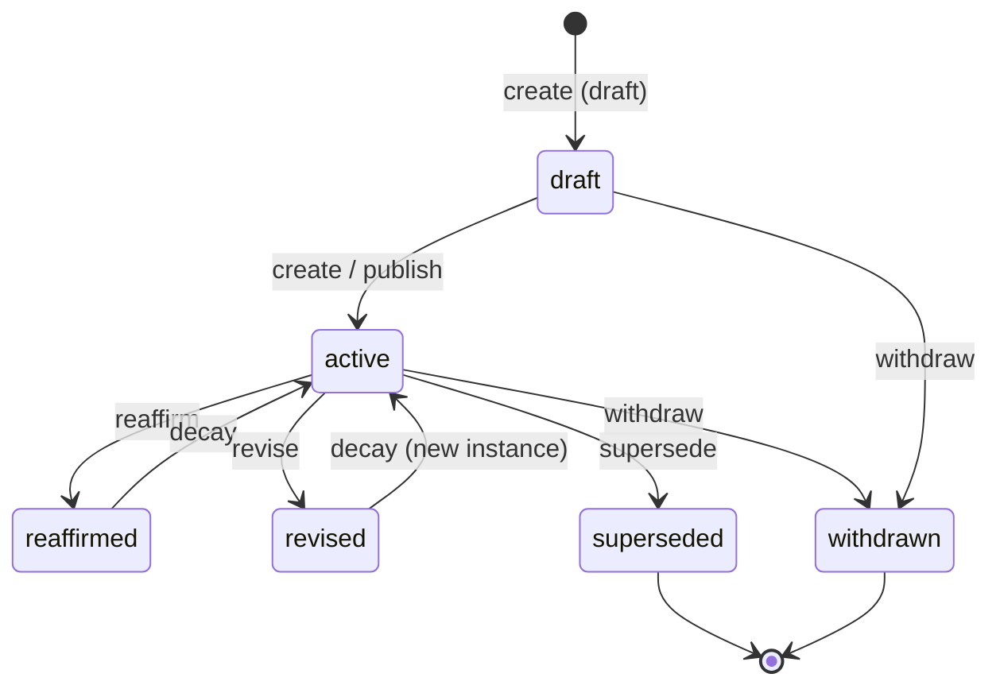

# DPKG Lifecycle State Machine

**Version:** 0.3.0
**Status:** Normative
**Date:** 2026-04-21

## 1. States

| State | Persistent? | Meaning |
|---|---|---|
| `draft` | yes | Author preparing, not yet published |
| `active` | yes | Claim is live and consumable |
| `reaffirmed` | transient | Emitted after a `reaffirm`; decays to `active` |
| `revised` | transient | Emitted after a `revise`; decays to `active` under the new instance |
| `superseded` | yes | A different claim has replaced this one; read-only |
| `withdrawn` | yes | Author retracted; terminal, read-only |

Steady-state representations in `manifest.json.claims[].state` are
restricted to `{draft, active, superseded, withdrawn}`. The transient
states exist only as labels on provenance events.

## 2. Events

| Event | Emits new `claim_instance_id`? | Requires `target_claim_instance_id`? |
|---|---|---|
| `create` | yes | no (no prior instance exists) |
| `revise` | yes | yes (points at superseded instance) |
| `reaffirm` | no | yes (points at current active instance) |
| `withdraw` | no | yes (points at instance being retracted) |
| `supersede` | no (creates a new `claim_id`) | yes (old instance id) |
| `duplicate` | not on-wire — merge-time verdict only | n/a |

`duplicate` is not a wire event; it is the verdict a merging consumer
emits when two packages import the same `claim_id` with identical
`content_hash`. Same `claim_id` with different `content_hash` is
`ERR-SEM-DUPLICATE-HASH-COLLISION`, not a duplicate.

## 3. State diagram (Mermaid)



## 4. Legal / illegal transition matrix

Rows = current persistent state. Columns = event. Cell = next persistent
state, or `ILLEGAL (error-code)`.

|            | `create`             | `reaffirm`            | `revise`              | `supersede`           | `withdraw`            |
|---|---|---|---|---|---|
| `(new)`    | `draft` or `active`  | ILLEGAL (ERR-SEM-REAFFIRM-NO-CLAIM) | ILLEGAL (ERR-SEM-REVISE-NO-CLAIM) | ILLEGAL (ERR-SEM-SUPERSEDE-NO-CLAIM) | ILLEGAL (ERR-SEM-WITHDRAW-NO-CLAIM) |
| `draft`    | ILLEGAL (ERR-SEM-LIFECYCLE-ILLEGAL) | ILLEGAL (ERR-SEM-LIFECYCLE-ILLEGAL) | `draft`               | ILLEGAL (ERR-SEM-LIFECYCLE-ILLEGAL) | `withdrawn`           |
| `active`   | ILLEGAL (ERR-SEM-LIFECYCLE-ILLEGAL) | `active`              | `active` (new instance) | `superseded`          | `withdrawn`           |
| `superseded` | ILLEGAL             | ILLEGAL (ERR-SEM-LIFECYCLE-ILLEGAL) | ILLEGAL (ERR-SEM-LIFECYCLE-ILLEGAL) | ILLEGAL (ERR-SEM-LIFECYCLE-ILLEGAL) | ILLEGAL (ERR-SEM-LIFECYCLE-ILLEGAL) |
| `withdrawn` | ILLEGAL            | **ILLEGAL** (ERR-SEM-LIFECYCLE-ILLEGAL) | ILLEGAL (ERR-SEM-LIFECYCLE-ILLEGAL) | ILLEGAL (ERR-SEM-LIFECYCLE-ILLEGAL) | ILLEGAL (ERR-SEM-LIFECYCLE-ILLEGAL) |

The withdraw → reaffirm cell is the sample scenario tested by
`samples/withdraw-then-illegal-reaffirm/`.

## 5. Symmetry, idempotency, and ordering

### 5.1 Duplicate semantics across packages

When two packages import the same `claim_id`:

- Identical `content_hash` → consumer MAY coalesce into a single claim,
  emitting a `duplicate` merge-verdict. Provenance events from both
  packages are concatenated and re-sorted (§5.4).
- Different `content_hash` → consumer MUST fail with
  `ERR-SEM-DUPLICATE-HASH-COLLISION`. No automatic reconciliation.

### 5.2 Reaffirm idempotency

- Multiple `reaffirm` events on the same `claim_instance_id` produce
  distinct `event_id`s and distinct timestamps but **no** new
  `claim_instance_id`. The manifest state stays `active`.
- Two consecutive `reaffirm` events with the same `(actor, timestamp)`
  pair are permitted; `event_id` makes them distinguishable.

### 5.3 Import-order irrelevance

Given two packages A and B that share no claim_id collision, the
consumer state after `import(A); import(B)` MUST be canonically equal
to the state after `import(B); import(A)`. "Canonically equal" is
defined in P6 (round-trip tests): timestamps compared as epoch-ms,
lists as multisets, floats within `1e-9`, JSON keys irrelevant.

If A and B collide per §5.1, import order is moot: both orderings MUST
raise the same error on the second import.

### 5.4 Canonical event ordering

Events MUST be sorted by the composite key:

```
(occurred_at_ms, event_id_lex)
```

- `occurred_at_ms` = UTC milliseconds since epoch parsed from
  `event.timestamp`. The UUIDv7 embedded timestamp MAY be used as a
  tiebreaker when timestamps disagree by < 1 ms, but timestamps are
  authoritative.
- `event_id_lex` = full `event_id` string compared ASCII-ascending.

Producers MUST write `provenance.jsonl` in this order. Consumers MUST
re-sort on read to be resilient to malformed producers.

### 5.5 target_claim_instance_id requirement

- `create` and `publish` MUST NOT include `target_claim_instance_id`
  (no prior instance exists to point at). Forbidden presence →
  `ERR-SEM-LIFECYCLE-ILLEGAL`.
- `reaffirm`, `revise`, `supersede`, `withdraw` MUST include
  `target_claim_instance_id` pointing at the instance in force at the
  time of the event. Missing target → `ERR-SEM-REAFFIRM-MISSING-TARGET`
  (for `reaffirm`) or the generic `ERR-SEM-LIFECYCLE-ILLEGAL` (for
  the rest).

## 6. Timestamp rules

1. All timestamps MUST be UTC, ISO-8601 with `Z` suffix.
2. Sub-second precision MAY be omitted. When present, it MUST be
   exactly 3 digits (millisecond precision, e.g. `2026-04-21T00:00:00.123Z`).
3. Sub-millisecond precision (microsecond, nanosecond, picosecond) is
   **forbidden**. Examples that MUST be rejected:
   - `2026-04-21T00:00:00.123456Z` (6 digits) — `ERR-SYN-TIMESTAMP-NS`
   - `2026-04-21T00:00:00.123456789Z` (9 digits) — `ERR-SYN-TIMESTAMP-NS`
4. Offsets other than `Z` (e.g. `+00:00`, `-07:00`) are forbidden —
   `ERR-SYN-TIMESTAMP-NS`.

## 7. Error codes (added by this document)

See `spec/error-codes.md` for the authoritative list.

- `ERR-SEM-LIFECYCLE-ILLEGAL` — any illegal transition per §4 matrix.
- `ERR-SYN-TIMESTAMP-NS` — timestamp has sub-millisecond precision or
  non-`Z` offset.
- `ERR-SEM-REAFFIRM-MISSING-TARGET` — `reaffirm` event lacks
  `target_claim_instance_id`.
- `ERR-SEM-DUPLICATE-HASH-COLLISION` — same `claim_id` across packages
  with different `content_hash`.
